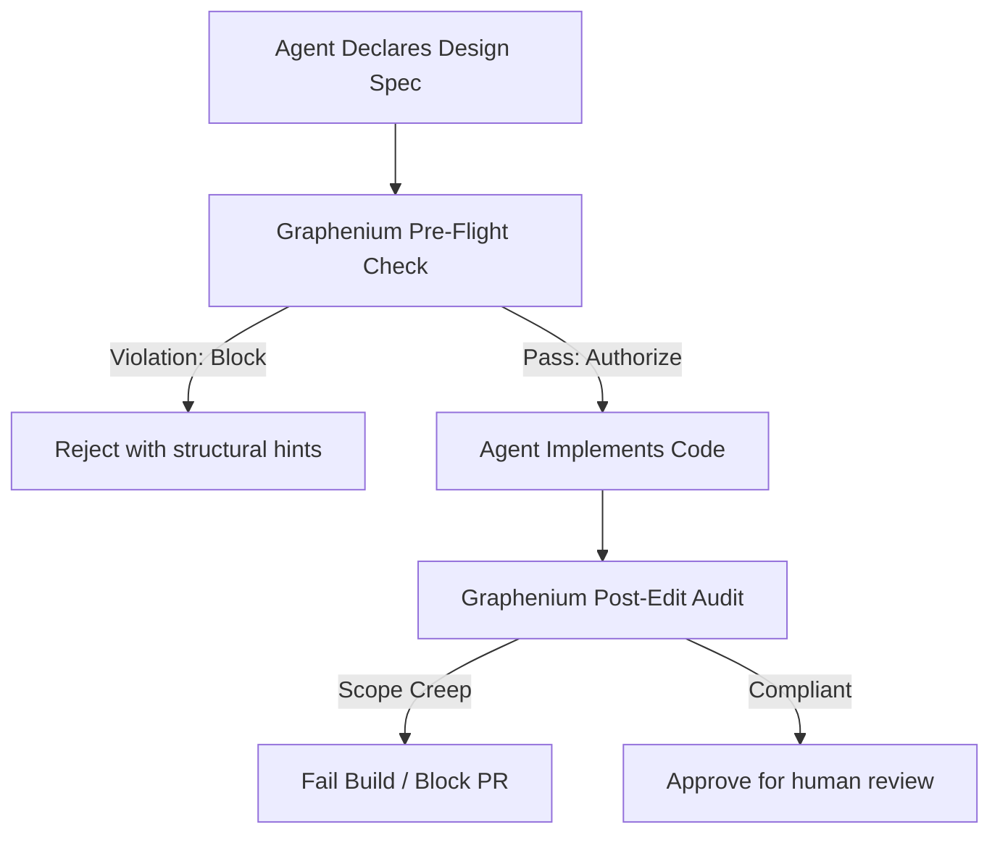

<p align="center">
  
</p>

**Graphenium is a local, pre-flight linter and external architecture gate for AI coding agents.**

It enforces structural compliance on AI assistants (such as Claude Code, Cursor, Aider, and Grok) by mechanically blocking code changes that violate your module boundaries, bypass your service layers, or introduce architectural drift. 

Standard developer tools help agents find files. Graphenium prevents agents from creating architectural debt.

```text
Without Graphenium (Vibe-Coding)        With Graphenium (Containment)
--------------------------------        -----------------------------
Agent edits files blindly               Agent validates design pre-flight
Agent ignores architectural layers      Graphenium blocks direct boundary violations
Constraints decay in long chats         External Datalog engine enforces strict rules
Reviewer hunts for bypassed layers      Reviewer gets deterministic scope-creep audits
CI checks only test passing             CI fails on architectural drift
```

Binary: `gm`  
Schema: `0.2.0`  
Status: AST + Stack Graphs resolver stable, pre-flight policy engine stable, zero-drift delta gating stable, telemetry overlay experimental

---

## Why Graphenium Exists: The Containment Gap

AI coding agents are highly efficient at local edits, but they suffer from **structural blindness and context decay**. Over a long chat session, an agent will lose track of your system instructions and optimize for the path of least resistance (e.g., writing a raw database call inside an HTTP controller to make a local test pass). 

Relying on "soft" guardrails like `CLAUDE.md` or system prompts to maintain design patterns does not work. When context windows get full, these constraints are dropped.

Graphenium establishes **external engineering governance**. It operates outside the LLM context, treating architectural boundaries as a strict, compiled contract.



---

## The Core Technical Lifecycle: Design-then-Verify

Graphenium enforces an explicit three-step compiler loop on the agent:

1.  **Declare Intent (Pre-Flight Spec):** Before editing any code, the agent registers its planned changes (classes, methods, and dependencies) in a virtual planning workspace.
2.  **Transitive Policy Solving:** Graphenium's engine runs a local Datalog solver to analyze the proposed virtual AST. If the design bypasses an intermediary architectural layer or uses banned symbols, Graphenium blocks the plan and provides structural feedback.
3.  **Zero-Drift Delta Gating:** Even without a `.graphenium/policy.json` file, Graphenium applies in-memory modularity analysis (ΔQ) and surprise edge profiling to reject plans that mathematically degrade community structure.
4.  **Post-Facto Compliance Audit:** After the agent writes the code, Graphenium parses the physical modifications, ensuring that the agent did not touch files outside the declared scope, introduce unplanned dependencies, or fail to implement its declared spec.

---

## Quick Start

```sh
# 1. Initialize workspace
# Generates .grapheniumignore with standard project defaults
gm init

# 2. Build local AST and Stack Graphs index (No LLM keys required)
gm run . --no-semantic --no-viz

# 3. Diagnose codebase health and import resolution
gm doctor --graph graphenium-out/graph.json --resolution

# 4. Analyze structural neighborhoods
gm query "authentication flow" --budget 2000

# 5. Start the MCP server for AI coding agents
gm serve --graph graphenium-out/graph.json --watch
```

---

## Installation

```sh
# From a local checkout
cargo install --locked --path .

# Or use the platform installer
curl -fsSL https://raw.githubusercontent.com/lambda-alpha-labs/Graphenium/main/install.sh | sh
```
*Requires Rust 1.81 or later. Tree-sitter language grammars are compiled and bundled.*

---

## Core Technical Capabilities

### 1. AST-Proven Provenance (Facts vs. Heuristics)
Most AI developer tools use LLMs to guess how modules depend on each other, leading to hallucinations. Graphenium establishes an index of compiler-proven truth using Tree-sitter and Stack Graphs. Every relationship carries explicit provenance:
*   `EXTRACTED` **(AST-Proven):** Compiler-backed facts (imports, type inheritance, explicit call signatures).
*   `INFERRED` **(Heuristics):** Semantic leads that the agent is forced to verify.
*   `AMBIGUOUS` **(Collisions):** Identifier collisions that force the agent to halt and inspect source files directly.

### 2. Datalog-Powered Policy Solving
Static linters can check direct imports, but they are blind to multi-hop architectural bypasses. Graphenium solves this by compiling your codebase structure into logical facts and running an embedded **Datalog inference engine** (`src/analyze/query.rs` & `stdlib.dl`). 

It uses first-order logic and fixed-point iteration to mathematically prove boundary violations over an infinite number of dependency hops.

### 3. Zero-Drift Delta Gating (Topological Entropy Guardrails)
Even without explicit policy rules, Graphenium applies in-memory modularity analysis to every planning workspace. The delta engine compares physical-only and virtual (plan-overlay) subgraphs, computing Louvain modularity deltas (ΔQ) and profiling surprise edges. Plans that degrade community structure or introduce architectural shortcuts (`cross-community`, `peripheral→hub`) are rejected automatically.

Available via `evaluate_delta_gate` (MCP), `validate_plan` (orchestrator), and `gm check --delta --plan <id>` (CLI).

### 4. Declarative Structural Governance
Enforce system design boundaries at commit-time or in CI. You declare rules in `.graphenium/policy.json` at the root of your repository:

```json
{
  "rules": [
    {
      "type": "forbidden_dependency",
      "from_pattern": "src/controllers/**",
      "to_pattern": "src/db/**",
      "reason": "Controllers must use services, not access DB directly"
    },
    {
      "type": "strict_layering",
      "layers": [
        "src/serve/**",
        "src/analyze/**",
        "src/extract/**",
        "src/model/**"
      ],
      "reason": "Respect tiered architecture: serve -> analyze -> extract -> model"
    }
  ]
}
```

Use `gm check --plan <id> --strict` to run pre-flight policy checks and post-facto compliance audits in CI.

```sh
# Topological delta gate (zero-config modularity protection)
gm check --delta --plan <id>
```

---

## Language Support

Graphenium supports mixed repositories with Rust, Python, Go, JavaScript, TypeScript, Java, C, C++, and C#.

C# projects receive build-boundary awareness through `.sln` and `.csproj` parsing, enabling Graphenium to model assemblies, namespaces, and project references as structural boundaries.

---

## MCP Setup

Integrate Graphenium directly into your agent's execution loop. For tools that spawn MCP from the project directory, use the `scripts/graphenium-mcp` launcher (rebuilds only when the index is missing, keeping startup instantaneous).

```sh
install -m 755 scripts/graphenium-mcp ~/.local/bin/graphenium-mcp
```

### Claude Code
```sh
claude mcp add graphenium --scope user -- gm serve --graph /path/to/graphenium-out/graph.json --watch
```

### Grok
Configure in `~/.grok/config.toml`:
```toml
[mcp_servers.graphenium]
command = "/Users/<you>/.local/bin/graphenium-mcp"
args = []
enabled = true
```

### Cursor
Add to `~/.cursor/mcp.json`:
```json
{
  "mcpServers": {
    "graphenium": {
      "command": "gm",
      "args": ["serve", "--graph", "/path/to/graphenium-out/graph.json", "--watch"]
    }
  }
}
```

---

## Detailed Documentation Map

### Root
| Document | Purpose |
|---|---|
| [`AI_SETUP.md`](AI_SETUP.md) | Step-by-step assistant setup playbook. |
| [`CONTRIBUTING.md`](CONTRIBUTING.md) | Contributor guidelines and module reference. |
| [`CHANGELOG.md`](CHANGELOG.md) | Release history and milestone summary. |
| [`SECURITY.md`](SECURITY.md) | Local-first security guarantees and vulnerability reporting. |
| [`MANIFEST.md`](MANIFEST.md) | Complete package manifest indexing all documentation. |

### Core Documentation (`docs/`)
| Document | Purpose |
|---|---|
| [`docs/GETTING_STARTED.md`](docs/GETTING_STARTED.md) | Installation, initial codebase indexing, and MCP setup. |
| [`docs/AGENT_WORKFLOWS.md`](docs/AGENT_WORKFLOWS.md) | Containment workflows: pre-flight, in-edit planning, and verification. |
| [`docs/CI_AND_GOVERNANCE.md`](docs/CI_AND_GOVERNANCE.md) | Enforcing architecture policies in CI pipelines. |
| [`docs/COMMAND_REFERENCE.md`](docs/COMMAND_REFERENCE.md) | Complete CLI syntax and configuration arguments. |
| [`docs/MCP_TOOLS.md`](docs/MCP_TOOLS.md) | Behavior specifications for MCP clients. |
| [`docs/ARCHITECTURE.md`](docs/ARCHITECTURE.md) | Indexing pipelines, C# project references, and Datalog evaluation. |
| [`docs/TRUST_MODEL.md`](docs/TRUST_MODEL.md) | Under-the-hood details of AST-proven vs heuristic confidence. |
| [`docs/BENCHMARKING.md`](docs/BENCHMARKING.md) | Performance metrics: latency, token budgets, and scaling limits. |
| [`docs/COMPARISON.md`](docs/COMPARISON.md) | Why Graphenium is distinct from grep, AST tools, and GraphRAG. |
| [`docs/POSITIONING.md`](docs/POSITIONING.md) | Market positioning, target personas, and competitive differentiation. |
| [`docs/HARNESS_ADAPTER.md`](docs/HARNESS_ADAPTER.md) | Embedding Graphenium's structural engine as a library. |
| [`docs/WORKED_EXAMPLES.md`](docs/WORKED_EXAMPLES.md) | Case studies proving containment on real repositories. |
| [`docs/GRAPH_REPORT.md`](docs/GRAPH_REPORT.md) | Interpreting the generated codebase audit report. |
| [`docs/DOCUMENTATION_MAP.md`](docs/DOCUMENTATION_MAP.md) | Full documentation ecosystem overview. |

### Agent Integration
| Document | Purpose |
|---|---|
| [`skills/graphenium/SKILL.md`](skills/graphenium/SKILL.md) | Agentic skill instructions and containment behavior rules. |
| [`contrib/harness-adapter/README.md`](contrib/harness-adapter/README.md) | Embedding Graphenium's engine inside AI coding harnesses. |

### Case Studies (`worked/`)
| Document | Purpose |
|---|---|
| [`worked/README.md`](worked/README.md) | Overview of structural containment case studies. |
| [`worked/TEMPLATE.md`](worked/TEMPLATE.md) | Template for documenting new codebase case studies. |
| [`worked/graphenium-self-analysis/README.md`](worked/graphenium-self-analysis/README.md) | Graphenium self-analysis: applying the containment engine to itself. |
| [`worked/graphenium-self-analysis/sample-queries.md`](worked/graphenium-self-analysis/sample-queries.md) | Sample query output on Graphenium's own codebase. |

---

## Contact & Enterprise

*   Issues and Feature Requests: [GitHub Issues](https://github.com/lambda-alpha-labs/Graphenium/issues)
*   Security Reports: security@graphenium.dev
*   Design partners, enterprise pilots, and partnerships: hello@graphenium.dev

---

## License

MIT. See [`docs/LICENSE.md`](docs/LICENSE.md).