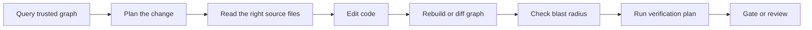

<p align="center">
  
</p>

**Graphenium is the local trust and verification layer for AI coding agents.**

It turns a repository into a provenance-aware architecture graph so agents can plan code changes, inspect blast radius, follow source-backed relationships, and verify edits before they land.

Most developer tools help people search files. Graphenium helps AI agents avoid unsafe edits.

```text
Without Graphenium                 With Graphenium
------------------                 ----------------
Agent greps blindly                Agent queries a trusted architecture map
Agent guesses dependencies         Agent sees provenance on every edge
Agent edits before planning        Agent plans before touching code
Reviewer hunts for blast radius    Reviewer gets risk-sorted impact
CI checks only tests               CI can also gate graph trust quality
```

Binary: `gm`  
Schema: `0.2.0`  
Status: AST plus resolver stable, semantic pass stable, telemetry overlay experimental

## Why Graphenium exists

AI coding agents are now capable of large code changes, but they still struggle with repository navigation and dependency trust. They often over-read irrelevant files, under-read critical files, infer relationships from names, and make changes without knowing what depends on what.

Graphenium gives agents a compact structural memory of the codebase.

The result is a safer engineering loop:



## The promise

Graphenium helps teams answer five questions before trusting an AI-generated code change:

1. What does this symbol depend on?
2. What depends on this symbol?
3. Which relationships are source-backed and which are only inferred?
4. What files should the agent read before editing?
5. What must be verified after the edit?

## Quick start

```sh
# 1. Initialize workspace
# Creates .grapheniumignore with sensible defaults.
gm init

# 2. Build a local graph with no API key required.
gm run . --no-semantic --no-viz

# 3. Inspect graph quality.
gm doctor --graph graphenium-out/graph.json

# 4. Query the architecture map.
gm query "authentication flow" --budget 2000

# 5. Start the MCP server for AI coding agents.
gm serve --graph graphenium-out/graph.json
```

## Install

```sh
# From a local checkout
cargo install --locked --path .

# Or use the installer
curl -fsSL https://raw.githubusercontent.com/lambda-alpha-labs/Graphenium/main/install.sh | sh
```

Requires Rust 1.81 or later. Tree-sitter language grammars are bundled.

## MCP setup

For Grok and project-local development, use the `scripts/graphenium-mcp` launcher. It prefers `target/release/gm`, auto-builds only when `graph.json` is missing, and starts `gm serve --watch`. Set `GRAPHENIUM_AUTO_REBUILD=1` to also rebuild when source or binary is newer than the graph.

```sh
install -m 755 scripts/graphenium-mcp ~/.local/bin/graphenium-mcp
```

See `docs/AI_SETUP.md` for full per-tool configuration.

### Claude Code

```sh
claude mcp add graphenium --scope user -- gm serve --graph /path/to/graphenium-out/graph.json --watch
```

### Grok

```toml
[mcp_servers.graphenium]
command = "/Users/<you>/.local/bin/graphenium-mcp"
args = []
```

### Codex

Add this to `~/.codex/config.toml`:

```toml
[mcp_servers.graphenium]
command = "gm"
args = ["serve", "--graph", "/path/to/graphenium-out/graph.json", "--watch"]
```

### Cursor

Add this to `~/.cursor/mcp.json`:

```json
{
  "mcpServers": {
    "graphenium": {
      "command": "gm",
      "args": ["serve", "--graph", "/path/to/graphenium-out/graph.json", "--watch"]
    }
  }
}
```

## Core capabilities

### 1. Trust-aware architecture graph

Graphenium extracts files, modules, functions, methods, classes, imports, calls, uses, inheritance, implementations, tests, build targets, and dependencies into a local graph.

Every relationship carries provenance:

| Field | Why it matters |
|---|---|
| `extractor` | Shows which component created the relationship |
| `resolution_status` | Shows whether the target was resolved |
| `confidence` | Separates source-backed facts from inferred or ambiguous leads |

Agents can plan against `EXTRACTED` relationships, treat `INFERRED` relationships as leads, and stop for source inspection when an edge is `AMBIGUOUS`.

### 2. Pre-edit pathfinding

Before an agent edits code, Graphenium helps it resolve the target symbol, find callers and downstream consumers, choose the safest source-backed path, and identify the first files to read.

Useful tools:

- `analyse_symbol`
- `get_neighbors`
- `query_transitive`
- `safest_path`
- `next_files_to_read`
- `blast_radius`

### 3. In-edit planning workspaces

For multi-file changes, agents can declare intended symbols before writing code. Graphenium stores the plan as a virtual workspace and later compares it to the extracted physical graph.

```text
Plan declared       Implementation written       Compliance checked
-------------       ----------------------       ------------------
planned symbols --> actual code symbols     --> implemented, missing, unplanned
```

### 4. Post-edit verification and CI gates

After a change, Graphenium can compare graph snapshots, compute downstream impact, create a verification plan, and enforce trust policies in CI.

```sh
gm diff --before old-graph.json --after graphenium-out/graph.json --impact --review-plan
gm check --graph graphenium-out/graph.json --min-resolution 80 --max-ambiguous 10
```

### 5. Local-first operation

The AST-only pipeline runs entirely on your machine. Source code is not sent to a remote service unless you explicitly configure semantic extraction with an API key and provider.

## Supported languages

Graphenium supports mixed repositories with Rust, Python, Go, JavaScript, TypeScript, Java, C, C++, and C#.

C# projects receive additional build-boundary awareness through `.sln` and `.csproj` parsing, which maps projects, assemblies, namespaces, and project references as first-class graph structure.

## Documentation

| Document | Purpose |
|---|---|
| [`docs/DOCUMENTATION_MAP.md`](docs/DOCUMENTATION_MAP.md) | Full coverage map from the original documentation set to this improved documentation pack |
| [`docs/GETTING_STARTED.md`](docs/GETTING_STARTED.md) | Guided installation, first scan, first query, and MCP setup |
| [`docs/AGENT_WORKFLOWS.md`](docs/AGENT_WORKFLOWS.md) | Operating playbooks for agents before, during, and after code changes |
| [`docs/COMMAND_REFERENCE.md`](docs/COMMAND_REFERENCE.md) | CLI command reference for `gm` |
| [`docs/MCP_TOOLS.md`](docs/MCP_TOOLS.md) | MCP tool catalog and tool selection guide |
| [`docs/ARCHITECTURE.md`](docs/ARCHITECTURE.md) | Three-tier model, graph schema, extraction pipeline, and module map |
| [`docs/TRUST_MODEL.md`](docs/TRUST_MODEL.md) | Practical guide to confidence, provenance, and safe agent behavior |
| [`docs/CI_AND_GOVERNANCE.md`](docs/CI_AND_GOVERNANCE.md) | CI gates, PR review, change governance, and adoption policy |
| [`docs/BENCHMARKING.md`](docs/BENCHMARKING.md) | Token, latency, and task-quality benchmarking methodology |
| [`docs/COMPARISON.md`](docs/COMPARISON.md) | Competitive comparison and when to choose Graphenium |
| [`docs/AI_SETUP.md`](docs/AI_SETUP.md) | AI assistant setup playbook |
| [`docs/HARNESS_ADAPTER.md`](docs/HARNESS_ADAPTER.md) | Embedded harness integration guide |
| [`docs/CONTRIBUTING.md`](docs/CONTRIBUTING.md) | Contributor guide |
| [`docs/SECURITY.md`](docs/SECURITY.md) | Security model and vulnerability reporting |
| [`docs/CHANGELOG.md`](docs/CHANGELOG.md) | Release history summary |
| [`docs/CODE_OF_CONDUCT.md`](docs/CODE_OF_CONDUCT.md) | Community standards |
| [`docs/LICENSE.md`](docs/LICENSE.md) | MIT license text |
| [`worked/README.md`](worked/README.md) | Worked examples guide |
| [`worked/TEMPLATE.md`](worked/TEMPLATE.md) | Template for new worked examples |
| [`skills/graphenium/SKILL.md`](skills/graphenium/SKILL.md) | Skill instructions for Graphenium-aware assistants |

## The shortest pitch

**Graphenium gives AI coding agents a trusted map of your codebase and a preflight check before they change it.**

## Contact

- Issues and feature requests: [GitHub Issues](https://github.com/lambda-alpha-labs/Graphenium/issues)
- Security reports: security@graphenium.dev
- Design partners, enterprise pilots, and partnerships: hello@graphenium.dev

## License

MIT. See [`docs/LICENSE.md`](docs/LICENSE.md).
