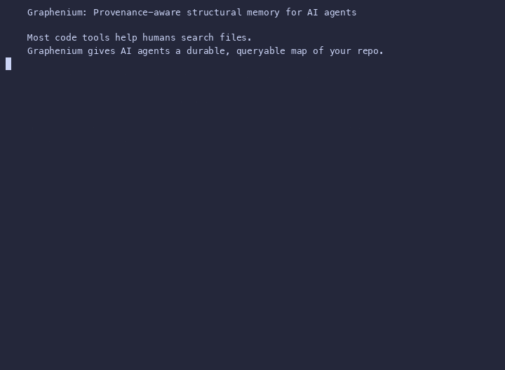

# Graphenium

**Provenance-aware structural memory for AI coding agents.**

Graphenium turns a repository into a persistent, queryable architecture graph
so Claude, Cursor, and other MCP-compatible assistants can navigate large
codebases without starting from zero every session.

Most code tools help humans search files. Graphenium gives AI agents something
more useful: a durable map of the repository, with confidence and provenance on
every relationship. The assistant can see not only what is connected, but how
that connection was discovered and how much it should trust it.

Use Graphenium when grep-and-trace navigation breaks down:

- What calls this function?
- What depends on this module?
- What are the architectural hubs?
- What is the shortest path between these components?
- Which files belong to the same community?
- What is the blast radius of this change?
- Which graph facts are source-backed, inferred, or ambiguous?
- Does this repository still meet the trust-quality bar for CI?

Graphenium replaces repeated repository navigation, not source-code
understanding. Agents still read source code before making implementation
changes. They just start with structural memory instead of a blank context
window.

Status: AST + Resolver, Semantic Pass, symbol diff, and `gm check` quality gates
are stable. Telemetry Overlay is experimental.



---

## Why Graphenium is different

There are many code search tools, semantic search tools, and static analyzers.
Graphenium is built for a narrower and increasingly important lane:

> **Trust-aware repository memory for AI coding agents.**

A useful agent does not only need matching files. It needs orientation, paths,
impact, confidence, compact context, and verification guidance. Graphenium is
designed around that workflow.

| Need | Generic code search | Generic code graph | Graphenium |
|---|---|---|---|
| Find text or symbols | Yes | Sometimes | Yes |
| Understand repository topology | Limited | Yes | Yes |
| Persist structure across sessions | Usually no | Sometimes | Yes |
| Serve context directly to AI agents | Limited | Sometimes | MCP-first |
| Explain confidence and provenance | Rare | Rare | Core model |
| Separate extracted, inferred, and ambiguous facts | Rare | Rare | Yes |
| Show change blast radius | Rare | Sometimes | Built in |
| Enforce repository trust gates in CI | Rare | Rare | Built in with `gm check` |
| Keep context compact for LLMs | Not primary | Not primary | Primary design goal |

Graphenium is not trying to be the biggest static analyzer or the broadest
semantic search database. It is trying to be the most reliable structural
memory and quality-gate layer an AI coding agent can use before it reads files
or proposes changes.

---

## The problem

AI coding assistants are good at reading code, but they navigate repositories
like a human using `grep`: search for a symbol, open the file, follow imports,
open more files, infer relationships, then repeat the same process in the next
session.

In a 50-file project, that works. In a 5,000-file monorepo with deep import
chains, it wastes time, tokens, and attention.

The usual workflow has five persistent problems:

- **Repeated cold starts.** Every new session begins without a durable model of
  the repository.
- **Context window pressure.** Raw source files are large. Navigation consumes
  tokens that should be used for reasoning.
- **No structural memory.** After reading files, the assistant has no persisted
  graph of how modules, functions, and concepts relate.
- **Missed cross-file relationships.** Grep surfaces text matches, not topology,
  hubs, communities, shortest paths, or blast radius.
- **Unclear trust boundaries.** Agents often cannot tell whether a relationship
  is source-backed, heuristic, LLM-inferred, or uncertain.

> **Context-token reduction.** Traditional grep-and-trace navigation forces an
> assistant to load raw source files merely to trace a call chain, quickly
> consuming tens of thousands of context tokens. Graphenium exposes repository
> topology as compact graph output, often fitting the useful structure of a
> large codebase into a few thousand tokens. That preserves the context window
> for reasoning and code synthesis instead of search.

Graphenium runs analysis once, persists the result as a graph, and exposes it
to assistants through an [MCP](https://modelcontextprotocol.io) server. A new AI
session can begin with the same structural knowledge the last one had.

---

## What changes with Graphenium

- **Orientation in seconds.** `architecture_summary` gives an agent a compact
  map of the codebase before it reads implementation files.
- **Focused context.** Instead of stuffing raw files into the context window for
  navigation, the assistant asks graph questions and reads only the files that
  matter.
- **Durable memory.** The graph persists across sessions and can be reloaded
  without restarting the MCP server.
- **Trust-aware reasoning.** Every edge carries confidence and provenance, so
  agents can distinguish source-backed facts from inferred leads.
- **Safer change planning.** `gm diff` identifies changed symbols, downstream
  impact, and a risk-sorted review order.
- **CI trust gates.** `gm check` enforces graph-quality thresholds so repository
  trust does not silently degrade.

---

## 20-second example

```text
Without Graphenium:
grep -> read file -> trace imports -> read more files -> infer architecture

With Graphenium:
query_graph -> get_neighbors -> shortest_path -> read only the right files
```

```sh
# Build a graph for your project, no API key needed
gm run . --no-semantic --no-viz

# Ask structural questions
gm query "what calls build_from_extraction?"

# Or connect an AI assistant through MCP and ask directly
```

---

## Quick start

### One-line install

```sh
curl -fsSL https://raw.githubusercontent.com/lambda-alpha-labs/Graphenium/main/install.sh | sh
```

### From source

Requires Rust 1.75+ ([rustup](https://rustup.rs)).

```sh
git clone https://github.com/lambda-alpha-labs/Graphenium
cd Graphenium
cargo install --path .
```

The binary is installed as `gm`.

### First run

```sh
# 1. Build a local graph, no API key needed
gm run . --no-semantic --no-viz

# 2. Query it with lexical, structural, or hybrid retrieval
gm query "authentication login session" --budget 1000

# 3. Check graph resolution coverage and trust metrics
gm doctor --resolution

# 4. Enforce quality gates, returning non-zero if graph quality degrades
gm check --min-resolution 80 --max-ambiguous 10
```

### After changes

Before making a change, save the current graph:

```sh
cp graphenium-out/graph.json old-graph.json
```

After rebuilding, compare the snapshots:

```sh
gm run . --no-semantic --no-viz
gm diff --before old-graph.json --after graphenium-out/graph.json --impact
```

---

## Core capabilities

### 1. Persistent repository graph

Graphenium models a repository as typed nodes and directed edges. Nodes include
functions, methods, classes, modules, structs, traits, documents, images,
build targets, CI jobs, and architectural concepts. Edges include imports,
containment, method membership, calls, uses, inheritance, implementations,
conceptual dependencies, rationale links, test coverage, and CI relationships.

The result is a durable structural memory that an assistant can query instead
of rediscovering the repository from scratch.

### 2. Provenance-aware trust model

Every node and edge is labeled with confidence and provenance.

| Confidence | Meaning | How agents should treat it |
|---|---|---|
| `EXTRACTED` | Tree-sitter AST, resolver output, Stack Graphs, or manually confirmed inspection | Treat as source-backed |
| `INFERRED` | LLM or behavioral heuristic reasoning | Treat as a high-probability hint |
| `AMBIGUOUS` | Heuristic uncertainty or conflicting evidence | Treat as a lead to investigate |

Provenance metadata records how a connection was produced:

- `extractor`: `tree-sitter`, `resolver`, `llm`, `manual-mcp-write`, or
  `runtime-otel`
- `resolution_status`: `resolved`, `unresolved`, `heuristic`, or `inferred`

Example agent-facing output:

```text
[Graphenium] Connection: require_session  calls  validate_token [resolver:resolved] -> High trust
[Graphenium] Connection: auth_service  uses  db_client [llm:inferred] -> Inspect before relying on it
[Graphenium] Connection: unknown_fn  calls  missing_module::do_thing [resolver:unresolved] -> Investigate before using
```

This is Graphenium's main design principle: **do not make the agent guess how
much to trust the graph.**

### 3. Symbol-level diff and blast-radius analysis

Graphenium is not only a passive repository map. It calculates the structural
consequences of code changes.

```sh
# Diff your current graph against an older snapshot to show impact
gm diff --before old-graph.json --after graphenium-out/graph.json --impact
```

`gm diff` gives the agent:

- **Symbol inventory diff.** Added, removed, renamed, or moved symbols.
- **Downstream impact.** Directed reverse reachability from changed symbols to
  affected callers or consumers.
- **Automated review order.** A risk-sorted plan that prioritizes removed
  symbols, community moves, then additions, weighted by dependency counts.
- **Verification planning.** Optional review plans show what should be read,
  tested, and inspected before relying on a change.

### 4. Policy-based quality gates for CI/CD

Graphenium can act as a local and CI-based quality gate for agent-generated or
human-authored code. The `gm check` command evaluates repository resolution
coverage, stale evidence ratio, ambiguous edge counts, and policy thresholds.

```sh
# Enforce trust quality gates in CI
gm check --min-resolution 80 --max-ambiguous 10
```

If the repository graph falls below your quality threshold, `gm check` returns a
non-zero exit code. That lets CI block a risky change or alert reviewers before
an agent or developer relies on degraded graph quality.

#### Graphenium is self-gated

Graphenium dogfoods its own trust model. The project CI runs `gm check` against
Graphenium's own graph on every commit, so changes that degrade resolution
quality, increase ambiguity beyond the threshold, or introduce stale evidence
are caught before release.

### 5. Agent-first MCP interface

Graphenium exposes compact graph tools through MCP, so assistants can ask
structural questions without reading unrelated source files.

Read tools:

| Tool | Purpose |
|---|---|
| `graph_stats` | Node/edge counts, file types, confidence and provenance breakdowns |
| `architecture_summary` | Communities, focus paths, god nodes, and confidence summary |
| `query_graph` | Keyword-scored BFS/DFS traversal within a token budget |
| `get_node` | Full node details by ID or label |
| `get_neighbors` | Direct neighbours with edge types and confidence |
| `get_community` | All nodes in a community cluster |
| `god_nodes` | Top N most-connected hub nodes |
| `shortest_path` | Path between any two components |
| `summarize_file` | Every symbol extracted from a source file |
| `reload_graph` | Hot-swap the graph without restarting |

Write tools:

| Tool | Purpose |
|---|---|
| `add_node` | Register concepts the AST cannot capture |
| `add_edge` | Record relationships confirmed through inspection |
| `remove_edge` | Correct false positives or stale relationships |

All writes persist to disk immediately.

v3 read tools, confidence-aware and policy-driven:

| Tool | Purpose |
|---|---|
| `resolution_report` | Resolution quality statistics: resolved vs unresolved reference counts and ratios |
| `ambiguous_symbols` | List low-trust edges with `AMBIGUOUS` confidence for manual review |
| `unresolved_references` | Missing dependencies the resolver could not bind |
| `safest_path` | Confidence-aware pathfinding between two nodes, preferring `EXTRACTED` edges |
| `verification_plan` | Prioritized verification plan based on impact and risk |
| `blast_radius` | Downstream impact analysis, files and symbols affected by a change |
| `agent_change_gate` | Policy-based gate checks for CI pipelines |
| `diff_graph` | Snapshot comparison, symbol-level diff between two graph versions |
| `next_files_to_read` | Reading order recommendation derived from a verification plan |
| `graph_info` | Full graph metadata: schema version, project root, build timestamp, languages, counts |
| `recluster` | Re-run community detection after manual node/edge edits |

### 6. Multi-mode retrieval

Graphenium supports multiple query modes:

```sh
gm query "authentication login" --mode lexical     # TF-cosine keyword scoring
gm query "database connection" --mode structural  # Topological neighbor clusters
gm query "parser ast walker" --mode hybrid        # Keyword plus structural proximity
gm query "parser ast walker" --safe               # Confidence-aware traversal
```

This keeps Graphenium structural-first while still allowing agents to retrieve
useful context when naming conventions differ across the codebase.

---

## Three-tier repository model

Graphenium offers three progressive layers of analysis. Run the mode that
matches your performance, privacy, and budget needs.

| Layer | What you get | Best for | Cost / API key |
|---|---|---|---|
| **1. AST + Resolver** (Terrain) **[Stable]** | Deterministic syntax extraction, import binding, resolved calls where supported, methods, inheritance, communities, build targets, and CI structure | Syntax-accurate architectural mapping and basic navigation | Free, local |
| **2. Semantic Pass** (Road Network) **[Stable]** | Inferred conceptual dependencies, docstring rationale, and cross-file relationships | Behavioral tracing and richer agent reasoning | Paid, LLM key |
| **3. Telemetry Overlay** (Live Traffic) **[Experimental]** | OTEL trace integration, P50/P95/P99 latency percentiles, regression comparison, and hot-path mapping | Runtime-aware optimization and production-sensitive refactoring | Free, local JSON |

```sh
# Tier 1: AST-only with deterministic import resolution, default local mode
gm run . --no-semantic --no-viz

# Tier 2: Add LLM-inferred relationships
gm run . --provider anthropic

# Tier 3: Import OpenTelemetry traces to weight graph edges with latency and frequency, experimental
# See src/telemetry.rs for the OTEL trace import API
```

The `graph_stats` tool reports edge confidence and provenance breakdowns, so
the assistant knows what kind of graph it is using.

---

## What Graphenium is good at

- **Large-codebase navigation.** Replace repeated grep-and-trace loops with
  persistent graph queries.
- **AI-assisted orientation.** Give agents a compact architecture map before
  they spend tokens on raw files.
- **Impact analysis.** Identify connected nodes and downstream consumers before
  changing a function, class, or module.
- **Refactoring planning.** Find god nodes, low-cohesion communities,
  surprising cross-boundary edges, and review order.
- **Code review.** Inspect changed symbols, affected communities, and risk
  surfaces before reviewing files line by line.
- **CI trust enforcement.** Use `gm check` to prevent graph-quality regressions
  and ambiguous dependency growth from entering the main branch.
- **Agent memory.** Preserve repository structure across assistant sessions.

## What Graphenium is not

- **Not a replacement for reading source code.** The graph captures structure
  and relationships, not implementation logic.
- **Not a full language server.** It does not perform complete type checking or
  language-specific semantic analysis at LSP depth.
- **Not a program executor.** Local graph extraction is static analysis plus
  optional LLM extraction. Telemetry overlays can import runtime data, but
  Graphenium does not execute the program.
- **Not a general-purpose semantic search engine.** Hybrid retrieval combines
  keyword and graph topology signals, but Graphenium is primarily a structural
  repository graph.
- **Not a security scanner.** Relationship graphs are not a substitute for
  dedicated SAST, taint analysis, or vulnerability research tools.

---

## MCP setup

Add Graphenium to your AI assistant's MCP config. The server uses the standard
MCP stdio transport. You can also run `gm setup <target>` to print the config
for your assistant.

**Claude Desktop** (`claude_desktop_config.json`):

```json
{
  "mcpServers": {
    "graphenium": {
      "command": "gm",
      "args": ["serve", "--graph", "/absolute/path/to/graphenium-out/graph.json"]
    }
  }
}
```

**Cursor** (`~/.cursor/mcp.json`):

```json
{
  "mcpServers": {
    "graphenium": {
      "command": "gm",
      "args": ["serve", "--graph", "/absolute/path/to/graphenium-out/graph.json"]
    }
  }
}
```

**CodeWhale** (`~/.codewhale/mcp.json`):

```json
{
  "servers": {
    "graphenium": {
      "command": "/absolute/path/to/gm",
      "args": ["serve", "--graph", "/absolute/path/to/graphenium-out/graph.json"],
      "env": {}
    }
  }
}
```

**After updating config, quit and relaunch the AI tool completely**. On macOS,
use Cmd+Q rather than closing the window. MCP servers are only loaded at
startup.

---

## AI Skill

The repo ships an AI Skill at `skills/graphenium/SKILL.md` that teaches
assistants which tool to reach for, how to interpret confidence levels, and how
to fall back to `gm query` when MCP is unavailable.

---

## Repository memory model

Graphenium models a codebase as nodes, edges, and topology.

### Nodes

Nodes represent meaningful entities: functions, methods, classes, modules,
structs, traits, documents, images, build targets, CI jobs, test cases,
dependencies, and architectural concepts. Each node carries metadata such as
label, qualified label, file type, source file, source location, confidence,
provenance, and community ID.

### Edges

Edges are typed, directed relationships.

| Relation | Meaning | Source |
|---|---|---|
| `imports` | Module-level import/include | AST / resolver |
| `contains` | Module/class contains a symbol | AST |
| `method` | Method belongs to a class/type | AST |
| `calls` | Function calls another function | AST / resolver / semantic |
| `uses` | Cross-file usage dependency | AST / resolver / semantic |
| `inherits` | OOP inheritance | AST / semantic |
| `implements` | Interface/trait implementation | AST / semantic |
| `depends_on` | Conceptual dependency or package dependency | AST / repository extraction / semantic |
| `tests` | Test case or test target verifies a symbol or module | AST / repository extraction |
| `runs_in` | Build target or test target runs in a CI job | CI extraction |
| `rationale_for` | Document/comment explains code | Semantic |

### Topology

Graphenium analyzes the graph to surface communities, hub nodes, shortest
paths, safest paths, surprising cross-community connections, architectural
focus paths, stale evidence, policy drift, and change impact. The assistant can
orient itself structurally before reading implementation details.

---

## Language support

Graphenium uses [tree-sitter](https://tree-sitter.github.io/) for AST
extraction across 9 languages.

| Language | Extensions | Extracted features |
|---|---|---|
| Python | `.py` | Classes, functions, imports, call graph |
| JavaScript | `.js`, `.mjs`, `.cjs` | Classes, functions, arrow functions, imports |
| TypeScript | `.ts`, `.tsx` | JavaScript features plus type declarations |
| Rust | `.rs` | Structs, enums, traits, impl blocks, functions, `use` |
| Go | `.go` | Functions, methods with receivers, import blocks |
| Java | `.java` | Classes, methods, package imports |
| C | `.c`, `.h` | Functions, include directives |
| C++ | `.cpp`, `.cc`, `.cxx`, `.hpp` | Classes, functions, include directives |
| C# | `.cs` | Classes, methods, using directives, namespaces |

Repository extraction also detects `Cargo.toml`, `package.json`, and GitHub
Actions workflows. Semantic extraction also processes documents (`.md`, `.rst`,
`.txt`), PDFs, and images.

Build with only the languages you need:

```sh
cargo build --release --no-default-features --features lang-python,lang-rust
```

Features: `lang-python`, `lang-js`, `lang-ts`, `lang-rust`, `lang-go`,
`lang-java`, `lang-c`, `lang-cpp`, `lang-csharp`.

---

## Commands

### `gm run`

Run the full analysis pipeline on a directory.

```text
gm run [PATH] [OPTIONS]
```

| Option | Description |
|---|---|
| `PATH` | Directory to analyze, default `.` |
| `--no-semantic` | Skip LLM extraction and use local structural results |
| `--no-viz` | Skip HTML generation |
| `--provider NAME` | AI provider: `anthropic`, `openai`, `openrouter`, `deepseek`, or `openai-compatible` |
| `--model NAME` | Model to use, defaults to provider-specific default |
| `--api-key KEY` | API key, overrides provider-specific env var |
| `--api-base URL` | API base URL for `openai-compatible` provider |
| `--mode deep` | Aggressive LLM inference |
| `--update` | Incremental mode: only re-extract changed files |
| `--no-report` | Skip GRAPH_REPORT.md generation |
| `--exclude-dirs DIRS` | Comma-separated directory names to exclude (e.g. `target,node_modules`) |

```sh
gm run . --no-semantic --no-viz      # Fast local structural scan
gm run . --provider openai           # With LLM semantic extraction
gm run . --update                    # Incremental after editing files
gm run . --no-report                 # Skip report generation
```

### `gm query`

Query an existing graph using multiple retrieval models.

```text
gm query "<keywords>" [OPTIONS]
```

| Option | Default | Description |
|---|---|---|
| `--graph PATH` | `graphenium-out/graph.json` | Path to graph file |
| `--budget N` | `2000` | Output token budget |
| `--mode MODE` | `lexical` | Retrieval model: `lexical` for TF-cosine keyword scoring, `structural` for graph-distance proximity, or `hybrid` |
| `--dfs` | off | Use depth-first search |
| `--safe` | off | Confidence-aware pathfinding: only traverse edges with `EXTRACTED` or `INFERRED` confidence, skip `AMBIGUOUS` |
| `--min-degree N` | 0 | Minimum node degree to include (filters low-degree noise) |
| `--exclude-test-nodes` | off | Exclude test/spec nodes from results |

```sh
gm query "parser ast walker" --safe               # Confidence-aware pathfinding
gm query "authentication login" --mode lexical    # TF-cosine keyword scoring
gm query "database connection" --mode structural  # Topological neighbor clusters
gm query "parser ast walker" --mode hybrid        # Keyword plus structural proximity
```

### `gm serve`

Start an MCP server exposing the graph over stdio.

```text
gm serve [OPTIONS]
```

| Option | Default | Description |
|---|---|---|
| `--graph PATH` | `graphenium-out/graph.json` | Path to graph file |
| `--watch` | off | Watch graph file for changes and auto-reload |

### `gm watch`

Watch a directory and auto-rebuild the graph on changes.

```text
gm watch [PATH] [OPTIONS]
```

| Option | Default | Description |
|---|---|---|
| `PATH` | `.` | Directory to watch |
| `--debounce SECS` | `3.0` | Wait after last event before rebuild |
| `--incremental` | `true` | Patch changed files. Use `false` for full rebuilds |

```sh
gm watch . --debounce 2.0
```

### `gm doctor`

Run diagnostic checks on your Graphenium installation: binary location, graph
file health, tree-sitter languages, API keys, schema, resolution quality, and
graph trust metrics.

Use `--schema` to dump the full graph schema (node kinds, edge kinds,
confidence levels, and provenance metadata). Use `--resolution` to generate a
detailed resolution-quality report covering resolved vs unresolved references.
Use `--repository` for repository metadata summary.

```text
gm doctor [--graph PATH]
gm doctor --schema              # Dump graph schema
gm doctor --resolution          # Resolution quality diagnostics
gm doctor --repository          # Repository metadata summary
```

### `gm check`

Run trust quality gates for CI. Evaluates the current graph against confidence,
resolution, ambiguity, stale-evidence, and architecture-drift thresholds.

```text
gm check [OPTIONS]
```

| Option | Default | Description |
|---|---|---|
| `--graph PATH` | `graphenium-out/graph.json` | Path to graph file |
| `--min-resolution N` | `80` | Minimum accepted resolution coverage percentage |
| `--max-ambiguous N` | `10` | Maximum allowed ambiguous edge count |

```sh
gm check                                      # Default quality gates
gm check --min-resolution 80 --max-ambiguous 10
gm check --min-resolution 70 --max-ambiguous 20 --strict  # Fail on degraded quality
```

### `gm diff`

Diff two graph snapshots and show symbol-level changes.

```text
gm diff [OPTIONS]
```

| Option | Default | Description |
|---|---|---|
| `--before PATH` | empty graph | Path to the old `graph.json` |
| `--after PATH` | `graphenium-out/graph.json` | Path to the new `graph.json` |
| `--impact` | off | Show downstream impact analysis and review order |
| `--review-plan` | off | Generate a prioritized verification plan based on symbol-level changes and community impact |

```sh
gm diff --before old-graph.json --after new-graph.json
gm diff --after new-graph.json --impact
gm diff --before old-graph.json --after new-graph.json --review-plan
```

### `gm setup`

Print ready-to-paste MCP config for an AI assistant.

```text
gm setup <claude|cursor|codewhale> [--graph PATH]
```

```sh
gm setup claude
gm setup cursor
gm setup codewhale
```

### `gm graph`

Inspect repository metadata and CI extraction results.

```text
gm graph schema [--graph PATH]                    # Show graph schema and metadata
gm graph build-map [--graph PATH]                 # Show detected build targets
gm graph test-map [--graph PATH]                  # Show detected test targets
gm graph migrate <graph.json>                     # Migrate older graph schema
```

```sh
gm graph schema
gm graph build-map
gm graph test-map
```

### `gm snapshot`

Manage graph snapshots for diff and drift analysis.

```text
gm snapshot create --name <name> [--graph PATH]
gm snapshot list
```

### `gm gate`

Run quality gates with diff-based analysis.

```text
gm gate --diff <before.json> <after.json>
```

---

## Output files

Graphenium writes outputs to `graphenium-out/` inside the analyzed directory.

| File | Purpose |
|---|---|
| `graph.json` | Machine-readable graph for `gm serve` and `gm query` |
| `GRAPH_REPORT.md` | Markdown architecture report |
| `graph.html` | Self-contained visual graph inspection page |
| `manifest.json` | mtime index for incremental updates |
| `cache/` | Per-file semantic extraction cache, SHA256 keyed |
| `quality.json` | Structured quality report: resolution ratio, ambiguous edges, per-file stats |
| | |
| **Scripts** | |
| `scripts/bench.sh` | Reproducible benchmark: cold index, graph load, query latency |

---

## Architecture

```text
src/
  extract/     tree-sitter syntax extraction for 9 languages plus repository config extraction
  model/       graph, node, edge, claim, hyperedge schemas, and graph metadata
  resolver.rs  cross-file import binding and target resolution
  trust.rs     evidence spans, claim model, resolution reporting
  harness.rs   trust-gate check for CI
  policy.rs    policy-based quality gates
  embed.rs     TF-based cosine similarities and Node2Vec structural embeddings
  cluster/     Louvain community detection, split/focus clustering, and cohesion scoring
  detect/      file classification, sensitive skipping, and corpus health checks
  analyze/     PageRank, chokepoints, dominators, reverse reachability, gates, and surprise edges
  serve/       MCP server, tool handlers, and mode-aware query traversal
  semantic/    async LLM batch extraction client and response parser
  telemetry/   OTEL trace import, EMA percentile estimation, regression compare, and hot paths
  export/      JSON export, HTML visualization, and schema export
  cache/       mtime manifest, semantic extraction cache, and graph snapshots
  watch.rs     file-system watcher with incremental patching and live blast-radius display
```

---

## v3 features

### 1. Evidence-backed graph facts

Graphenium stores confidence and provenance on graph relationships so agents can
separate source-backed facts from inferred or ambiguous leads. Evidence metadata
and resolution status make graph output inspectable instead of black-box.

### 2. CI extraction

Graphenium detects `Cargo.toml`, `package.json`, and GitHub Actions workflows
during extraction, creating graph nodes for build targets, external
dependencies, and CI pipeline stages. This enables drift detection between
declared dependencies, actual import usage, and configured pipeline behavior.

### 3. Architecture drift detection

Compare declared architecture in policy files or external docs against the
extracted graph. Drift is reported as mismatches between expected and actual
module boundaries, dependency directions, and community clusters.

### 4. Policy-based gates

Define policies in TOML files for confidence thresholds, allowed dependency
directions, module ownership, naming conventions, stale evidence, and ambiguity
budgets. Enforce them with `gm check` locally or in CI.

### 5. Watch-mode blast radius display

In watch mode (`gm watch`), Graphenium displays the blast radius of detected
changes in real time. As files are modified, the watcher highlights affected
symbols, dependents that need attention, and the risk-sorted review order.

### 6. Runtime telemetry comparison

Experimental telemetry support compares baseline and current OpenTelemetry
trace exports, helping connect structural changes to route-level or path-level
runtime regressions.

---

## Limitations

- **Local graphs are structural, not fully behavioral.** AST and
  resolver-backed extraction capture imports, containment, declarations, method
  relationships, and some resolved calls where language support is available.
  They do not model full runtime behavior, dynamic dispatch, reflection,
  generated code, or framework-specific execution paths. Richer cross-file
  `calls`, `uses`, and `implements` relationships may require the semantic
  pass, manual graph writes, or telemetry overlays.
- **Label collisions can still happen.** Common names like `new`, `mod`, and
  `run` appear across modules. Qualified labels, resolver metadata, and
  `resolution_status` help disambiguate results. `graph_stats` reports
  collision counts so you know when results may be fuzzy.
- **Large corpora need pruning.** Projects with many vendored dependencies
  should use `.grapheniumignore` to exclude `target/`, `node_modules/`,
  `.rust-toolchain/`, and similar directories.
- **Telemetry is an overlay, not a profiler.** Runtime trace ingestion can
  weight existing graph edges with latency and frequency data, but Graphenium
  does not replace a tracing backend, profiler, or APM system.
- **Quality gates are only as good as the graph and policy.** `gm check` helps
  enforce trust thresholds, but teams should tune policies to their repository,
  language mix, and risk tolerance.

---

## Contributing

Contributions are welcome, especially language extractors, MCP integrations,
fixtures, graph analysis tools, and agent workflows. See
[CONTRIBUTING.md](CONTRIBUTING.md).

[Good first issues](https://github.com/lambda-alpha-labs/Graphenium/issues?q=is%3Aissue+is%3Aopen+label%3A%22good+first+issue%22)
| [Worked examples](worked/)
| [Demo script](scripts/demo.sh)
