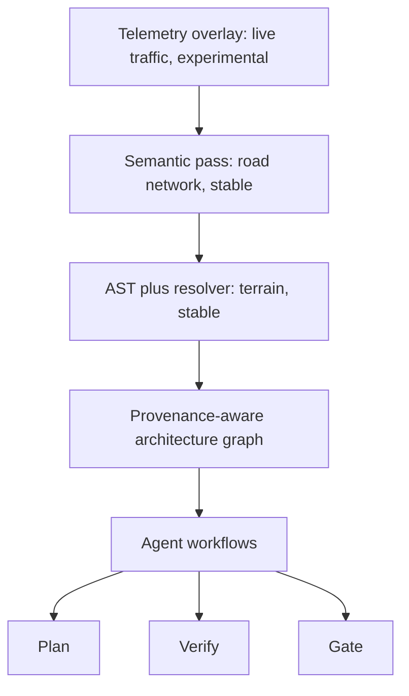
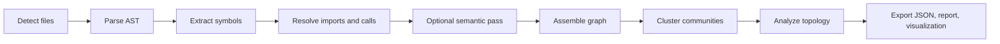

# Architecture

Graphenium is an active coordination and verification engine for AI coding agents. It is not a passive code search index.

Its architecture exists to support the full agent lifecycle:

1. Pre-edit pathfinding
2. In-edit planning
3. Post-edit compliance verification
4. CI trust gating

## Three-tier repository model



### Tier 1: AST plus resolver

This is the physical code structure.

Graphenium uses tree-sitter to parse supported files and extract symbols such as functions, classes, methods, structs, traits, imports, calls, uses, inheritance, implementations, tests, dependencies, and build targets.

The resolver builds a symbol index and links imports, uses, and cross-file references where it can. C# projects receive extra structure through `.sln` and `.csproj` parsing, including assemblies, root namespaces, and project references.

This tier produces the base graph.

### Tier 2: semantic pass

The optional semantic pass adds relationships that static extraction may miss, such as conceptual dependencies, delegation patterns, and architectural intent.

Semantic edges carry provenance and confidence. Agents must treat them as inferred unless the edge explicitly has source-backed provenance.

### Tier 3: telemetry overlay

The experimental telemetry layer imports OpenTelemetry trace JSON to produce runtime-aware graph data, including call counts and latency percentiles.

This enables hot-path queries and runtime-weighted traversal.

## Graph model

Each graph uses schema `0.2.0` and contains:

| Element | Examples |
|---|---|
| Nodes | files, modules, functions, methods, classes, structs, traits, tests, documents, build targets, CI jobs, dependencies |
| Edges | imports, contains, calls, uses, inherits, implements, tests, depends_on, runs_in |
| Hyperedges | n-ary relationships such as group membership |
| Communities | Louvain-detected architectural clusters |
| Metadata | schema version, build timestamp, project root, extraction mode, languages |

## Trust model in the graph

Every edge carries trust metadata.

| Field | Example values | Meaning |
|---|---|---|
| `extractor` | `tree-sitter`, `resolver`, `llm`, `csproj-parser` | Which component created the edge |
| `resolution_status` | `resolved`, `unresolved`, `heuristic` | Whether the target was found in the graph |
| `confidence` | `EXTRACTED`, `INFERRED`, `AMBIGUOUS` | How much an agent should trust the relationship |

The practical rule:

```text
EXTRACTED + resolved: plan against it
INFERRED: verify it
AMBIGUOUS: inspect source before acting
unresolved: treat as a gap
```

## Extraction pipeline



Detailed stages:

1. File detection walks the directory, classifies files, and respects `.grapheniumignore`.
2. AST parsing uses tree-sitter and language-specific extractors.
3. Import and cross-file resolution build source-backed graph relationships where possible.
4. Optional semantic extraction adds inferred behavioral relationships.
5. Graph assembly merges all extraction results.
6. Louvain clustering partitions nodes into architectural communities.
7. Analysis computes degree distributions, PageRank hubs, chokepoints, drift, and anomaly signals.
8. Export writes `graph.json`, quality reports, and optional visualization.

## Module map

| Module | Responsibility |
|---|---|
| `analyze/` | Architecture analysis, diff, impact, rank, god nodes, verifier |
| `build.rs` | Graph assembly pipeline |
| `cache/` | Manifest tracking and semantic caching |
| `cache/query.rs` | Salsa-backed incremental extraction |
| `cluster/` | Louvain community detection and drift analysis |
| `detect/` | File detection, classification, ignore rules, sensitive-file checks |
| `embed.rs` | TF text embeddings and structural embeddings |
| `export/` | JSON and HTML export |
| `extract/` | Tree-sitter extraction per language |
| `harness.rs` | Trust check harness and plan verification engine |
| `model/` | Graph, node, edge, hyperedge, and extraction result types |
| `policy.rs` | Trust quality policy evaluation |
| `ranking.rs` | Lexical, structural, and hybrid query scoring |
| `resolver.rs` | Cross-file import and reference resolution |
| `analyze/query.rs` | Datalog query engine |
| `semantic/` | LLM-based semantic extraction |
| `serve/` | MCP server and tool handlers |
| `telemetry.rs` | Runtime telemetry overlay |
| `trust.rs` | Evidence spans, claims, stale detection, resolution reports |
| `watch.rs` | File watcher for incremental rebuilds |
| `doctor.rs` | Diagnostic checks |
| `main.rs` | CLI entry point |

## Query modes

| Mode | Algorithm | Best for |
|---|---|---|
| Lexical | TF-cosine keyword matching | Finding nodes by name or description |
| Structural | Graph distance from keyword seeds | Finding topologically related code |
| Hybrid | Weighted lexical plus structural scoring | General discovery |
| Datalog | First-order logic fixpoint | Reachability and constraint queries |

## C# assembly boundary parsing

Enterprise C# codebases often have important build boundaries that do not match directory layout. Graphenium parses `.sln` and `.csproj` files to model:

- solution files
- projects
- assembly names
- root namespaces
- project references
- build-time dependency boundaries

These become first-class graph structure so agents can reason about compiled boundaries, not just file paths.

## Academic paper classification

Graphenium can classify Markdown and text files as research papers when they contain scholarly markers such as arXiv identifiers, DOIs, LaTeX citations, abstract markers, or proceedings indicators.

This lets scientific documentation sit beside implementation nodes in the same graph.

## Planning workspace schema

Nodes and edges can carry an optional `plan_id`. This separates planned virtual symbols from extracted physical code.

The verification engine compares:

| Planned graph | Physical graph | Result |
|---|---|---|
| Intended symbols | Extracted symbols | Implemented nodes |
| Intended relationships | Extracted relationships | Implemented edges |
| Declared file scope | Modified files | Unplanned modifications |

This enables formal design-then-verify workflows for agents.

## Betweenness and anomaly detection

Graphenium computes more than degree counts.

- PageRank finds popular or heavily referenced nodes.
- Betweenness centrality finds bridge nodes between communities.
- Surprise scoring finds unexpected links such as cross-community edges, source-to-document connections, peripheral-to-hub jumps, and out-of-boundary dependencies.

These signals help agents find architectural erosion before editing.

## Current limitations

| Limitation | Impact | Mitigation |
|---|---|---|
| Label collisions | Same label can map to multiple nodes | Use `get_node`, file paths, and disambiguation warnings |
| Dynamic dispatch and reflection | Some runtime relationships may be missed | Use semantic extraction, telemetry overlay, or verified manual edges |
| Telemetry overlay experimental | Runtime data requires explicit traces | Treat runtime-weighted results as supplemental |
| No built-in side-by-side diff viewer | Diff output is textual or JSON | Use `gm diff --json` with external viewers |
| No LSP completion | Graphenium is not an IDE language server | Use MCP tools for agents and CLI for scripts |
| Graph is not source | Agents still need direct file reads | Require source inspection before edits |

## Architecture principle

Graphenium is intentionally a map, not a replacement for code.

The map lets agents choose where to look, what to trust, and how to verify. The source remains the final authority.
