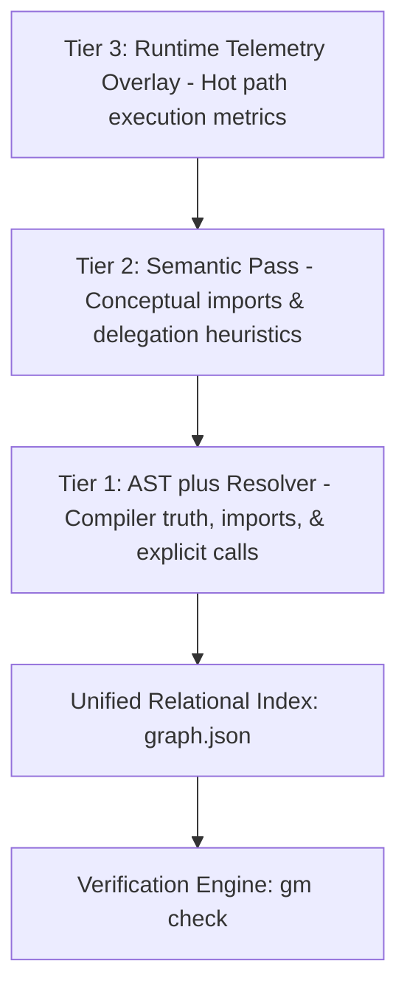
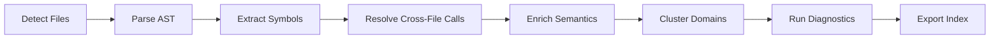

# Graphenium System Architecture

Graphenium is an active engineering containment layer and pre-flight linter for AI coding agents. It is not a passive code search index. 

Its architecture is engineered to mechanically govern the write-time behaviors of AI assistants, executing pre-flight policy checks and post-facto scope audits before code changes are committed to your repository.

---

## 1. The Three-Tier Codebase Indexing Model

To balance compile-time speed, semantic depth, and runtime relevance, Graphenium organizes codebase metadata into three tiers:



### Tier 1: AST plus Resolver (Compiler Truth)
This is Graphenium's core foundation. It runs entirely offline, requiring no remote API calls. 
*   **AST Parsing:** Graphenium uses local Tree-sitter parsers to extract code symbols (classes, structs, functions, interfaces, methods) directly from source files.
*   **Resolution Engine:** Our cross-file reference resolver builds an export index and binds imports, uses, and calls across file boundaries. 
*   **Boundary Parsing:** For C# environments, Graphenium parses Visual Studio `.sln` and `.csproj` files to model compiled assembly boundaries and namespaces.

### Tier 2: Semantic Pass (Conceptual Enrichment)
An optional, remote pass that uses LLMs (such as Claude, GPT-4o, or DeepSeek) to identify high-level design relationships that static compilers miss. It infers conceptual dependencies, delegation patterns, and architectural intent.

### Tier 3: Telemetry Overlay (Runtime Context)
An experimental runtime overlay that imports OpenTelemetry JSON trace files. It overlays call counts, P95 latencies, and execution frequencies onto Graphenium's static AST index, enabling agents to identify and protect production hot-paths.

---

## 2. The Relational Codebase Schema (v0.2.0)

Graphenium compiles your codebase into a structured relational index stored as a local `graph.json` file. The schema consists of:

| Element | Description | Examples |
|---|---|---|
| **Nodes** | Unique code entities and structural containers. | files, modules, classes, structs, functions, methods, test suites, build targets, package managers, and rationale documents. |
| **Edges** | Directed relationships between nodes. | imports, contains, calls, uses, inherits, implements, tests, and depends_on. |
| **Hyperedges** | N-ary relationships grouping 3 or more nodes. | Multi-module service participation or cross-file shared design patterns. |
| **Domains** | Louvain-partitioned cohesive architectural clusters. | Folders or packages with high internal coupling and minimal external exports. |

---

## 3. The AST-Proven Provenance Model

Graphenium enforces an explicit trust model on every relationship in the index. Each edge carries metadata defining its origin, confidence, and validation status:

```text
EXTRACTED + resolved: AST-proven compile truth  -> Safe to plan against
INFERRED  + inferred: Semantic guess             -> Treat as a hypothesis (verify)
AMBIGUOUS + ambiguous: Multi-target collision    -> Stop and inspect source code
```

*   **`extractor`:** Which module generated the edge (e.g., `tree-sitter`, `tree-sitter-stack-graphs`, `llm`, `csproj-parser`).
*   **`resolution_status`:** Whether the target is a concrete node present in the index (`resolved`, `unresolved`, `heuristic`).
*   **`confidence`:** The trust classification of the edge (`EXTRACTED`, `INFERRED`, `AMBIGUOUS`).

---

## 4. The Codebase Compilation & Indexing Pipeline

When you run `gm run`, Graphenium executes a highly concurrent indexing pipeline:



1.  **File Detection:** Walks the project root, respects `.gitignore` and `.grapheniumignore`, and filters out sensitive credentials or keys.
2.  **AST Parsing:** Uses parallel rayon worker threads to parse changed code files into tree-sitter ASTs.
3.  **Cross-File Resolution:** Resolves imports and binds behavior calls using a local, single-pass Stack Graphs binder.
4.  **Semantic Inference:** (Optional) Batches uncached text and image files through remote LLM endpoints to extract high-level conceptual boundaries.
5.  **Cohesion Partitioning:** Runs a native Louvain community clustering algorithm to partition the index into structural folder domains.
6.  **Hotspot & Anomaly Analysis:** Calculates centrality metrics (PageRank, betweenness centrality) and anomaly scores (Surprise Connections) to identify architectural erosion.
7.  **Diagnostic Export:** Writes the complete index to `graphenium-out/graph.json` and compiles a human-readable `GRAPH_REPORT.md`.

---

## 5. C# Compilation Boundary & Namespace Resolution

Enterprise C# codebases often have complex build boundaries that do not align with folder layouts. Graphenium's parser reads `.sln` and `.csproj` configurations to capture:
*   Project references and compilation dependencies.
*   Assembly output names and Root Namespace definitions.
*   Inheritance chains and interface contracts (`inherits`, `implements`) from AST `base_list` structures.

This ensures that AI agents can reason about C# assemblies and namespace scopes, preventing them from introducing invalid cross-project dependencies in Visual Studio solutions.

---

## 6. Planning Workspaces & The Virtual AST Spec

To support Graphenium's "Design-then-Verify" loop, the index supports an optional `plan_id` field. This allows Graphenium to maintain a **Virtual AST** representing the agent's proposed changes, decoupled from the actual, physical code on disk:

```text
Proposed Plan (Virtual AST)   ----->   Evaluated against .graphenium/policy.json
         |
         v (Approved)
Physical Implementation      ----->   gm check --plan compares physical to virtual
```

By maintaining a virtual-to-physical mapping, Graphenium mechanically detects:
*   **Implemented Nodes:** Successfully written classes and methods that match the approved design.
*   **Missing Nodes:** Declared symbols that the agent failed to implement.
*   **Scope Creep / Unplanned Edits:** Files modified by the agent that were not declared in the pre-flight plan.

---

## 7. Embedded Datalog Policy Solver

Before an agent edits code, Graphenium runs its proposed design plan through a local **Datalog inference engine** (`src/analyze/query.rs`). 

Graphenium parses your `.graphenium/policy.json` rules and translates them into Datalog query constraints. It then runs Graphenium's compiled Datalog standard library (`src/analyze/query/stdlib.dl`) over the virtual AST to mathematically prove boundary violations:

*   **`forbidden_dependency`:** Proves if any direct path is proposed from a banned glob pattern to another (e.g., `src/routes/**` directly referencing `src/db/**`).
*   **`strict_layering`:** Proves if any path violates a layered hierarchy (e.g., `repositories` attempting to import a `controller` class). Transitive, multi-hop bypasses are proven using the transitive dependency closure:
    ```prolog
    bypasses_layer(X, Y, Z) :-
        depends_transitive(X, Z),
        not depends_transitive(X, Y).
    ```
*   **`banned_symbol`:** Proves if the agent attempted to introduce or call a restricted module (e.g., direct raw SQL utilities).

---

## 8. Structural Domain Analysis & Anomaly Detection

Graphenium implements advanced network analysis algorithms to identify architectural decay:
*   **Betweenness Centrality:** Runs Brandes' algorithm to identify bottleneck symbols. These are critical "bridge" components; modifying them carries high risk because they connect otherwise isolated module domains.
*   **PageRank Centrality:** Ranks symbols by reference popularity, highlighting highly depended-on hotspots.
*   **Surprise Connections:** Scores relationships based on how unexpected they are. Connections that bridge different communities, cross folder domains, or link low-degree peripheral nodes directly to high-degree hotspots are flagged as architectural anomalies.

---

## 9. Current Technical Limitations

| Limitation | Structural Impact | Automated Mitigation |
|---|---|---|
| **Dynamic Dispatch & Reflection** | Purely static analysis may miss runtime dependency injections. | Use Graphenium's **optional semantic pass** or import **runtime telemetry traces** to overlay execution paths. |
| **Contextual Ambiguity** | Identical names in different folders can create identifier collisions. | Graphenium enforces the use of **qualified labels** and namespace scoping to distinguish identically named classes. |
| **No Source-Code Mutation** | Graphenium is a gating layer; it does not write code edits. | Run Graphenium directly inside git commit hooks or CI pipelines to block bad agentic output before merge. |