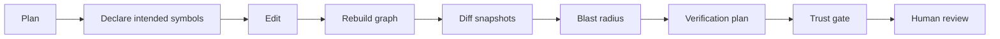

# CI and Governance

Graphenium turns architecture knowledge into reviewable, enforceable controls for AI-generated code changes.

## Why governance matters

Traditional CI answers:

- Did tests pass?
- Did formatting pass?
- Did linting pass?

For agent-authored changes, teams also need to know:

- Did the agent understand what it changed?
- What depends on the changed symbols?
- Did the patch cross architecture boundaries?
- Which relationships are inferred or ambiguous?
- Did the implementation match the declared plan?

Graphenium adds those checks.

## Governance loop



## Basic CI gate

```sh
gm run . --no-semantic --no-viz
gm check --graph graphenium-out/graph.json --min-resolution 80 --max-ambiguous 10
```

## Diff-based review

Create a snapshot before the agent works:

```sh
gm snapshot create before-agent-change
```

After the change:

```sh
gm run . --update --no-semantic --no-viz
gm diff --before graphenium-snapshots/before-agent-change.json --after graphenium-out/graph.json --impact --review-plan
```

## Pull request comment template

```text
Graphenium review summary

Changed graph nodes:
Removed symbols:
Added symbols:
Moved communities:
Highest-risk downstream consumers:
New inferred edges:
New ambiguous edges:
Must-read files:
Recommended tests:
Gate result:
Reviewer notes:
```

## Policy maturity model

| Stage | Policy | Goal |
|---|---|---|
| 1. Observe | Run graph builds and publish reports | Learn graph quality without blocking |
| 2. Warn | Warn on high ambiguity or low resolution | Educate agents and reviewers |
| 3. Gate high-risk changes | Gate public APIs, dependencies, and hubs | Protect critical paths |
| 4. Gate all agent PRs | Require blast radius and verification plan | Standardize agent review |
| 5. Enforce architecture boundaries | Use graph diff and policy rules | Prevent drift |

## Architecture policy (pre-flight)

Graphenium can block agent plans that violate structural dependency boundaries **before** any source code is written. Rules are declared in `.graphenium/policy.json` at the repository root.

### Policy file format

```json
{
  "rules": [
    {
      "type": "forbidden_dependency",
      "from_pattern": "src/controllers/**",
      "to_pattern": "src/db/**",
      "reason": "Controllers must use services, not access DB directly"
    },
    {
      "type": "strict_layering",
      "layers": [
        "src/serve/**",
        "src/analyze/**",
        "src/extract/**",
        "src/model/**"
      ],
      "reason": "Respect tiered architecture: serve → analyze → extract → model"
    },
    {
      "type": "banned_symbol",
      "symbol_label": "LegacyRawSql",
      "reason": "Use the repository abstraction instead"
    }
  ]
}
```

| Rule type | What it checks |
|---|---|
| `forbidden_dependency` | Planned edges from `from_pattern` to `to_pattern` (glob paths) |
| `strict_layering` | No planned node in layer *i* may depend on layer *j* where *j < i*; transitive violations use Datalog `depends_transitive` |
| `banned_symbol` | Planned symbols or dependency targets matching a label |

Patterns use glob syntax (same as `.grapheniumignore`). An empty or missing policy file skips pre-flight checks.

### When pre-flight runs

| Entry point | Behavior |
|---|---|
| `validate_plan` MCP tool | Explicit pre-flight check on a `plan_id` |
| `add_planned_symbol` | Automatic check; rejects with `PRE_FLIGHT_VIOLATION` on failure |
| `agent_change_gate` | Optional `plan_id` parameter adds a pre-flight section |
| `gm check --plan <id>` | Pre-flight gate, then post-facto compliance |

### CI example with planning workspace

```sh
gm run . --no-semantic --no-viz
gm check --graph graphenium-out/graph.json --plan agent-refactor-auth --strict
```

This fails if the declared plan violates architecture policy or if implementation does not match the plan.

## Recommended initial thresholds

For a new repository:

```sh
gm check --min-resolution 50 --max-ambiguous 50
```

For a mature graph:

```sh
gm check --min-resolution 80 --max-ambiguous 10
```

For critical repositories:

```sh
gm check --min-resolution 90 --max-ambiguous 0 --strict
```

Use strict gates only after the team understands extractor behavior and has tuned ignore rules.

## Agent PR requirements

A Graphenium-aware PR should include:

- target symbol or feature area
- graph query summary
- trust profile
- files read before editing
- changed symbols
- blast radius
- verification plan
- test plan
- unresolved or ambiguous relationships

## Example GitHub Actions job

```yaml
name: Graphenium Trust Gate

on:
  pull_request:

jobs:
  graphenium:
    runs-on: ubuntu-latest
    steps:
      - uses: actions/checkout@v4
      - uses: dtolnay/rust-toolchain@stable
      - name: Install Graphenium
        run: cargo install --locked --path .
      - name: Build graph
        run: gm run . --no-semantic --no-viz
      - name: Run trust gate
        run: gm check --graph graphenium-out/graph.json --min-resolution 80 --max-ambiguous 10
```

## What Graphenium gates should not replace

Graphenium complements, but does not replace:

- unit tests
- integration tests
- type checking
- compiler checks
- security scanning
- human code review
- runtime observability

## Governance principle

Use Graphenium to make agent assumptions explicit.

A good agent change does not merely pass tests. It shows what it believed, what evidence supported those beliefs, what it changed, and how the change was verified.
