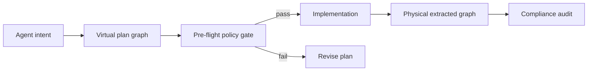

# Harness Adapter

The harness adapter shows how to embed Graphenium inside an AI coding harness.

Use this when you are building an agent runtime that should maintain a graph as the agent opens, saves, inspects, and modifies files.

## Dependency

```toml
[dependencies]
graphenium = { git = "https://github.com/lambda-alpha-labs/Graphenium", default-features = false, features = ["harness"] }
```

The `harness` feature keeps the dependency tree lean by excluding the MCP server and watch-mode dependencies. Enable specific language features for the languages you need.

## Lifecycle

```text
Workspace open
  -> initialize_graph(root)
  -> full AST scan
  -> Louvain clustering
  -> snapshot to disk

File opened or saved
  -> on_file_open(graph, path)
  -> re-extract one file
  -> patch graph

AI verifies a relationship in source
  -> on_edge_discovered(graph, source, target, relation, file)
  -> add verified edge

AI finds a false positive
  -> on_edge_invalid(graph, source, target, relation)
  -> remove edge

Periodic maintenance
  -> refresh_communities(graph)
  -> snapshot_to_disk(graph, path)

MCP sidecar needs current graph
  -> gm serve --graph /path/to/graph.json
```

## Planning workspace integration

Harnesses should use planning workspaces for multi-file agent changes.

1. Create a planning workspace.
2. Register intended symbols and relationships.
3. Run pre-flight architecture policy validation (`validate_plan_preflight` in `src/harness.rs`, or `validate_plan` via MCP).
4. Let the agent implement the change only if pre-flight passes.
5. Re-extract modified files.
6. Compare the planned virtual graph with the physical graph (`verify_plan`).
7. Report implemented, missing, and unplanned symbols.

Architecture rules load from `.graphenium/policy.json` via `ArchPolicyConfig::load_for_project` in `src/policy.rs`.



## Serving the graph

The simplest architecture is a sidecar MCP server:

```sh
gm serve --graph /path/to/graphenium-out/graph.json
```

The harness writes snapshots to disk. MCP clients read the current graph through `gm serve`.

## Minimal pseudocode

```rust
use graphenium_harness_adapter::*;
use std::path::Path;

let (mut graph, communities) = initialize_graph(Path::new("/path/to/project"));
snapshot_to_disk(&graph, Path::new("/path/to/project/graphenium-out/graph.json"))?;

let stats = on_file_open(&mut graph, Path::new("src/auth/service.rs"));
if stats.nodes_replaced > 0 {
    refresh_communities(&mut graph, &ClusterOptions::default());
    snapshot_to_disk(&graph, Path::new("/path/to/project/graphenium-out/graph.json"))?;
}

on_edge_discovered(
    &mut graph,
    "auth_service",
    "token_provider",
    "delegates_to",
    "src/auth/service.rs"
);

snapshot_to_disk(&graph, Path::new("/path/to/project/graphenium-out/graph.json"))?;

on_edge_invalid(&mut graph, "auth_service", "unrelated_fn", Some("imports"));
```

## Confidence model for harnesses

The harness must not let agents write guessed edges into the graph.

| Agent evidence | Write edge? | Confidence |
|---|---|---|
| Agent read source and verified relationship | Yes | `EXTRACTED` |
| Agent saw relationship in source and docs | Yes, with provenance | `EXTRACTED` |
| Agent suspects relation from naming | No | none |
| Agent is uncertain | No | none |

AI-discovered edges should only be added when the agent inspected source directly.

## Testing

```sh
cd contrib/harness-adapter
cargo test
```

## Best practices

- Keep graph snapshots atomic.
- Re-cluster after batches of meaningful edits.
- Keep agent-added edges auditable.
- Separate planned virtual nodes from extracted physical nodes.
- Do not auto-promote semantic guesses to `EXTRACTED`.
- Surface trust profile in the harness UI or agent transcript.
