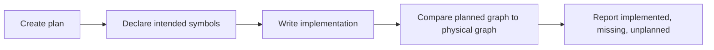

# MCP Tools Reference

Graphenium exposes MCP tools so AI coding agents can query repository structure without reading every file.

The tools are grouped into six categories:

1. Read tools
2. Composite tools
3. Trust tools
4. Planning workspace tools
5. Write tools
6. Diff tools

## Agent rule of thumb

```text
Start with graph_info.
Use read tools to understand.
Use trust tools before acting.
Use planning tools for multi-file work.
Use diff tools after edits.
Use write tools only after source inspection.
```

## Read tools

### `graph_info`

Returns project root, schema version, build timestamp, extraction mode, languages, node counts, edge counts, and graph identity.

Use when:

- starting a session
- confirming the loaded graph
- checking whether the agent is using the right repository

### `graph_stats`

Returns node, edge, hyperedge, community, node-type, and confidence distribution statistics.

Use when:

- checking graph scale
- assessing overall confidence profile
- deciding whether the graph is healthy enough to use

### `query_graph`

Searches the graph using keyword relevance and traversal.

Common parameters:

| Parameter | Purpose |
|---|---|
| `keywords` | Search query |
| `depth` | Traversal depth |
| `budget` | Output token budget |
| `dfs` | Use deeper, narrower traversal |
| `path_prefix` | Scope to a directory or module |
| `exclude_path` | Remove noisy paths |
| `include_relations` | Restrict relationship types |
| `exclude_relations` | Exclude relationship types |
| `node_types` | Restrict node kinds |
| `generated_code_mode` | Include, exclude, or only generated code |
| `include_tests` | Include test nodes |
| `min_degree` | Filter low-degree symbols |
| `ast_only_tuning` | Tune for AST-only graphs |

Use when:

- searching for feature-related code
- finding a target symbol
- exploring a module
- asking broad architecture questions

### `get_node`

Returns metadata for one node: label, file type, source file, source span, community, and degree.

Use when:

- resolving a symbol precisely
- checking source location
- disambiguating label collisions

### `get_neighbors`

Returns direct neighbors with relation types, confidence levels, and scores.

Useful options include relation filters, max neighbors, and extracted-only mode.

Use when:

- asking what calls a symbol
- asking what a symbol calls
- checking imports, uses, inherits, or implements relationships
- planning direct-impact changes

### `get_community`

Returns community-level context and optionally full member lists.

Use when:

- understanding architectural clusters
- finding module boundaries
- checking whether a symbol sits in the expected community

### `god_nodes`

Returns the most connected nodes after filtering obvious noise.

Use when:

- identifying hubs
- finding high-risk change targets
- spotting architectural chokepoints

### `shortest_path`

Returns a path between two nodes.

Modes:

| Mode | Meaning |
|---|---|
| `strict` | Fewest hops |
| `semantic` | Prefers meaningful relationships |

Use when:

- explaining how two parts connect
- checking whether a dependency path exists

### `summarize_file`

Returns graph symbols extracted from a file, grouped by kind or community.

Use when:

- answering what is in a file without reading the full source
- choosing whether a file deserves direct inspection

### `architecture_summary`

Returns repository-level architecture summary with major communities, cross-community connectors, and hotspots.

Use when:

- entering a new repository
- preparing an agent orientation
- creating a map before a multi-file change

### `query_transitive`

Returns a transitive closure from a seed symbol.

Parameters include seed, depth, relation, and direction.

Use when:

- finding all downstream consumers
- finding all upstream dependencies
- tracing impact across multiple hops

### `run_datalog`

Runs a Datalog query against the loaded graph.

Use when:

- asking declarative reachability questions
- finding constraint violations
- building custom graph analyses

Example:

```text
?- calls(X, Y, _).
```

## Composite tools

### `analyse_symbol`

Returns a complete single-symbol analysis: node metadata, behavioral connections, structural connections, and trust profile.

Use when:

- preparing to edit a symbol
- creating a pre-edit safety plan

### `module_dependencies`

Summarizes dependency connections between two modules or directories.

Use when:

- checking boundary coupling
- explaining why two modules are connected
- reviewing architecture drift

### `what_changed`

Returns a risk-sorted delta against a snapshot: removed symbols, community moves, additions, and downstream impact.

Use when:

- reviewing an agent patch
- producing a pull request review plan

## Trust tools

### `resolution_report`

Returns import resolution, call resolution, ambiguous edge count, and unresolved references.

Use before trusting graph output for a high-risk change.

### `ambiguous_symbols`

Lists ambiguous edges and collisions that require source inspection.

Use when an agent needs to know what not to assume.

### `unresolved_references`

Lists references whose targets were not found in the graph.

Use when diagnosing missing extraction, unsupported language features, or ignore-rule issues.

### `safest_path`

Returns the highest-confidence path between two symbols, plus a safety score.

Use when correctness matters more than shortest route.

### `verification_plan`

Returns a prioritized verification plan for changed nodes.

Typical output tiers:

1. must-read files
2. affected public interfaces
3. downstream consumers
4. tests to inspect or run
5. ambiguous edges to verify
6. architecture gates
7. CI policy results

### `blast_radius`

Returns downstream impact for changed nodes: affected files, communities, and confidence profile.

Use before and after agent edits.

### `agent_change_gate`

Evaluates policy gates such as minimum resolution and maximum ambiguous edges.

Use in CI or pre-review agent workflows.

## Planning workspace tools

Planning tools support the design-then-verify loop.



### `create_planning_workspace`

Creates a virtual workspace and returns a plan ID.

Use when starting a multi-step architectural change.

### `add_planned_symbol`

Registers an intended symbol or relationship before implementation.

Use when declaring the design the agent intends to implement.

### `get_plan_details`

Returns the virtual subgraph of the plan and implementation status.

Use before review to compare intent with result.

Important: compliance checking is performed by reviewing plan details and using `verification_plan`. The core library also has a `verify_plan` engine for embedded harnesses.

## Write tools

Write tools should be used carefully. Do not write guesses into the graph.

### `add_node`

Adds an architectural concept, rationale node, external system, or manually verified entity.

### `add_edge`

Adds a verified relationship.

Only use `EXTRACTED` confidence when the relationship was confirmed by source inspection.

### `remove_edge`

Removes a false positive or stale relationship.

### `recluster`

Re-runs community detection after meaningful manual edits.

## Diff tools

### `diff_graph`

Compares two graph files and returns added or removed nodes and edges.

### `review_plan`

Generates a full review plan from graph diffs.

Use when preparing pull request review for agent-authored changes.

## Tool selection guide

| Goal | Best first tool |
|---|---|
| Confirm graph identity | `graph_info` |
| Understand repository shape | `architecture_summary` |
| Find code related to a feature | `query_graph` |
| Understand a symbol | `analyse_symbol` |
| Find direct callers or dependencies | `get_neighbors` |
| Find multi-hop impact | `query_transitive` |
| Explain connection between two symbols | `shortest_path` and `safest_path` |
| Check graph trust quality | `resolution_report` |
| Plan verification after editing | `verification_plan` |
| Measure downstream impact | `blast_radius` |
| Review a changed graph | `what_changed` or `review_plan` |
| Enforce policy | `agent_change_gate` |
| Run custom logic | `run_datalog` |

## Output interpretation

Treat Graphenium output as a map, not the territory.

| Evidence | Agent action |
|---|---|
| `EXTRACTED` and resolved | Safe to plan against, still read source before editing |
| `INFERRED` | Strong lead, verify at least one source file |
| `AMBIGUOUS` | Do not act until inspected |
| unresolved | Investigate missing symbol, dynamic code, generated code, or ignore rules |
